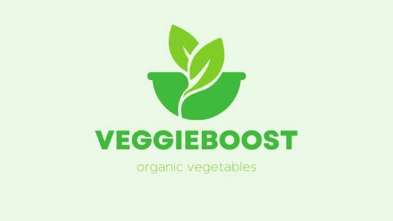
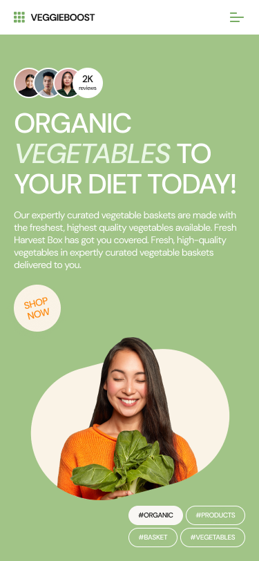
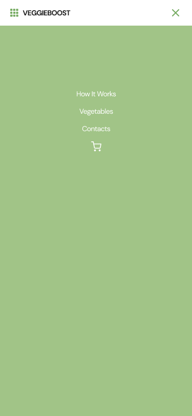

<h1>Sass "VEGGIEBOOST"</h1>

---

## Description

**A responsive and adaptive** landing page for the food retail industry.

This is an educational project made by students of the #itgirlsschool.

## About the project

Veggieboost implemented on Sass preprocessor. In the project were used the following technologies:

- Flexbox
- CSS Grid Layout

This website is displayed correctly at all resolutions _from 320px to 2560px and higher._ For resolutions less than 680px, a hamburger menu has been implemented on pure CSS.

The project has animation for hovering the cursor over buttons and product cards. And it also has navigation through page sections.

## Future scope

- Add Pop-up element
